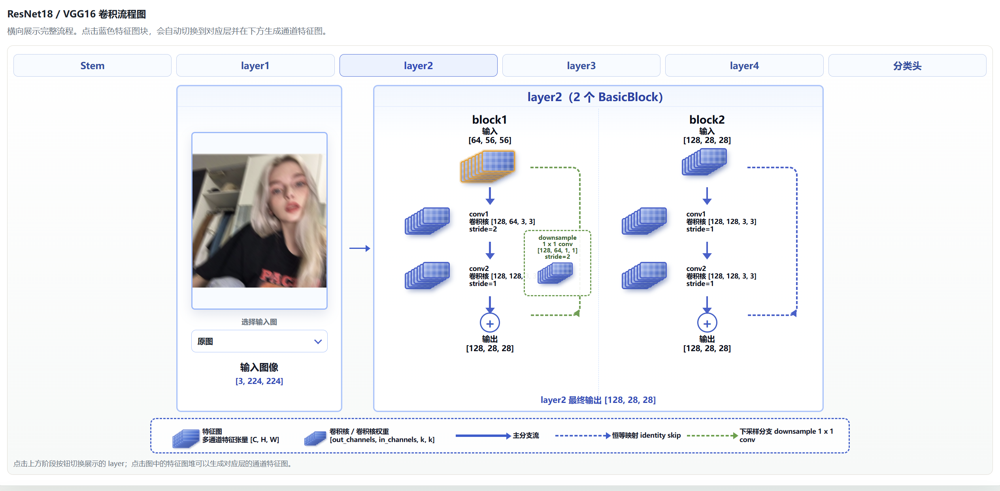
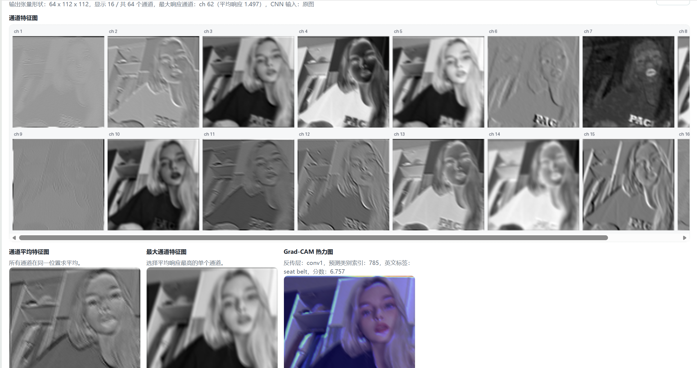
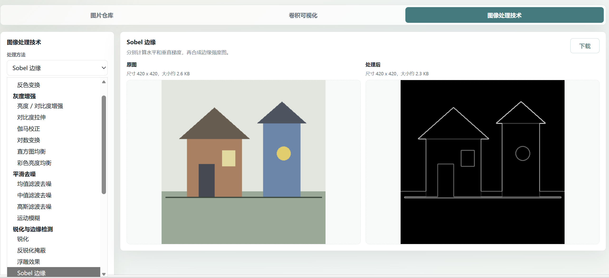

# 数字图像处理可视化系统操作手册

本项目是一个数字图像处理大作业系统，使用 Flask 作为后端，使用 HTML、CSS 和 JavaScript 实现前端交互。系统把传统数字图像处理、图像放缩压缩、CNN 特征图可视化和 Grad-CAM 热力图结合在一起，方便观察不同图像处理方法对图像本身和卷积神经网络特征响应的影响。

## 重要说明：模型权重不会上传到 GitHub

本项目使用 TorchVision 的 ImageNet 预训练模型：

- VGG16：权重文件约 528 MiB。
- ResNet18：权重文件约 45 MiB。

这些模型权重体积较大，不建议上传到 GitHub。项目已经在 `.gitignore` 中忽略 `weights_cache/` 目录。

第一次运行 CNN 特征图或 Grad-CAM 功能时，程序会联网自动下载权重。下载位置为：

```text
weights_cache/hub/checkpoints
```

也就是说，上传 GitHub 时只需要上传代码、README、示例图片和配置文件即可；模型权重让用户第一次使用时自动下载。如果运行环境不能联网，需要手动把对应权重文件放到上面的目录中。

## 1. 功能概览

系统主要包含三个页面：

1. **图片仓库**
   - 查看系统内置示例图片。
   - 上传自己的图片。
   - 选择当前操作图片。

2. **卷积可视化**
   - 支持 VGG16 和 ResNet18。
   - 支持选择不同卷积层。
   - 显示通道特征图。
   - 显示通道平均特征图。
   - 显示最大响应通道特征图。
   - 显示 Top-K 激活通道。
   - 显示 Grad-CAM 热力图。
   - 可以把传统图像处理后的图片作为 CNN 输入，观察卷积结果变化。

3. **图像处理技术**
   - 支持灰度化、反色、亮度增强、对比度拉伸、伽马校正、直方图均衡。
   - 支持均值滤波、中值滤波、高斯滤波、运动模糊。
   - 支持锐化、反锐化掩蔽、Sobel、Prewitt、Roberts、Laplacian、高通滤波。
   - 支持 Otsu 二值化、自适应阈值。
   - 支持腐蚀、膨胀、开运算、闭运算。
   - 支持图像放大、缩小和压缩。

## 2. 界面展示

建议将项目运行效果图放在 `docs/images` 目录下。下面三张图分别展示卷积网络蓝图、CNN 特征图结果和传统图像处理页面。

### 2.1 ResNet18 蓝图结构展示



这张图展示 ResNet18 的横向网络流程。上方按钮可以切换 Stem、layer1、layer2、layer3、layer4 和分类头；点击蓝色特征图块后，会自动切换到对应层并在下方生成通道特征图。蓝色虚线表示 identity skip，绿色虚线表示 downsample 分支。

### 2.2 CNN 特征图与 Grad-CAM 展示



这张图展示卷积层输出的多个通道特征图，同时展示通道平均特征图、最大响应通道特征图和 Grad-CAM 热力图。它可以帮助观察不同通道对图像中边缘、纹理和语义区域的响应。

### 2.3 传统图像处理技术展示



这张图展示传统图像处理页面。左侧是处理方法分类列表，右侧同时显示原图和处理后图像，并显示图像尺寸和文件大小，便于对比不同处理方法的效果。

如果 GitHub 页面中图片没有显示，请确认这三张截图已经按上面的文件名放入 `docs/images` 目录，并一起提交到仓库。

## 3. 环境要求

建议使用 Python 3.10 或 Python 3.11。

主要依赖如下：

```text
Flask
Pillow
numpy
torch
torchvision
gunicorn
```

依赖已经写在 `requirements.txt` 中，可以直接安装。

## 4. 本地启动

进入项目目录后执行：

```bash
pip install -r requirements.txt
```

启动 Flask 服务：

```bash
python server.py
```

启动成功后，浏览器打开：

```text
http://127.0.0.1:5000
```

如果希望局域网内其他设备访问，可以使用终端中显示的局域网地址，例如：

```text
http://本机IP:5000
```

## 5. 图片仓库使用方法

打开系统后，默认进入“图片仓库”页面。

### 5.1 选择示例图片

页面中会显示系统内置的示例图片。点击任意图片后，该图片会成为当前操作图片。

后续的传统图像处理、放缩压缩和 CNN 可视化都会基于当前选中的图片进行。

### 5.2 上传图片

点击上传按钮后选择本地图片。系统支持：

```text
jpg / jpeg / png / webp
```

上传成功后，图片会保存到 `static/examples` 目录，并出现在图片仓库中。

## 6. 图像处理技术页面使用方法

切换到“图像处理技术”页面后，左侧是操作面板，右侧是结果展示区域。

### 6.1 传统图像处理

操作步骤：

1. 在“处理方法”下拉框中选择一种图像处理方法。
2. 页面会显示该方法的技术原理说明。
3. 点击“生成处理结果”。
4. 右侧会显示原图和处理后的图像。
5. 如果该方法使用了卷积核，页面会显示对应卷积核。

常见方法说明：

- **灰度化**：将 RGB 图像转换为单通道灰度图。
- **滤波去噪**：通过均值、中值或高斯滤波降低噪声。
- **边缘检测**：通过 Sobel、Prewitt、Roberts、Laplacian 等方法提取边缘。
- **阈值分割**：将图像转换为黑白二值图。
- **形态学处理**：对二值图进行腐蚀、膨胀、开运算、闭运算。

### 6.2 放缩 / 压缩技术

该区域用于调整图像尺寸和文件大小。

可选择的方法：

- **线性插值**：通过双线性插值计算缩放后的像素。
- **PCA 主成分分析**：保留图像主要成分，实现低秩近似压缩。
- **因子分析低秩近似**：使用较少潜在因子近似表示图像结构。

可设置参数：

- **尺寸比例（%）**
  - 可以从候选值中选择，例如 25、50、100、200。
  - 也可以手动输入自定义比例。

- **输出宽度 / 输出高度**
  - 两个都填写：输出指定宽高。
  - 只填写宽度：系统按比例自动计算高度。
  - 只填写高度：系统按比例自动计算宽度。
  - 都不填写：按尺寸比例缩放。

- **目标文件大小（KB）**
  - 可以选择常用大小，例如 30 KB、100 KB、500 KB。
  - 也可以手动输入自定义目标大小。
  - 设置目标大小后，系统会使用 JPEG 质量压缩尽量接近目标大小。

生成结果后，页面会显示：

- 原图尺寸。
- 处理后尺寸。
- 原图文件大小。
- 处理后文件大小。
- JPEG 质量参数。

## 7. 卷积可视化页面使用方法

切换到“卷积可视化”页面后，可以分析 VGG16 或 ResNet18 的中间层特征。

### 7.1 基本操作

操作步骤：

1. 选择操作图片。
2. 选择模型：`VGG16` 或 `ResNet18`。
3. 选择查看层。
4. 选择显示通道数。
5. 选择单张特征图尺寸。
6. 选择 Top-K 激活通道数量。
7. 点击“生成特征图”。

系统会显示：

- 通道特征图。
- 通道平均特征图。
- 最大响应通道特征图。
- Top-K 激活通道。
- Grad-CAM 热力图。

### 7.2 输入图像处理

在卷积流程图的“输入图像”位置，可以选择：

- 原图。
- 灰度化后的图。
- 锐化后的图。
- 边缘检测后的图。
- 其他传统图像处理结果。

选择后，系统会把处理后的图像作为 CNN 输入，再生成特征图。这样可以观察传统图像处理方法对 CNN 特征响应的影响。

### 7.3 特征图说明

- **通道特征图**
  - 显示某一层多个通道的响应。
  - 每个通道可以理解为一个卷积核检测到的模式。

- **通道平均特征图**
  - 对所有通道在同一空间位置求平均。
  - 用来观察该层整体响应趋势。

- **最大响应通道特征图**
  - 找到平均响应最高的单个通道。
  - 用来观察最活跃的特征模式。

- **Top-K 激活通道**
  - 自动找出响应最高的前 K 个通道。
  - 显示平均激活值、最大激活值和激活区域占比。

- **Grad-CAM 热力图**
  - 用来解释模型分类时关注图像中的哪些区域。
  - 红色区域表示对当前预测类别贡献较大。

## 8. VGG16 和 ResNet18 说明

系统支持两个 ImageNet 预训练模型：

### VGG16

VGG16 是顺序堆叠的卷积神经网络，主要由多个 3x3 卷积层和池化层组成。

特点：

- 结构简单直观。
- 没有残差连接。
- 适合展示从浅层到深层的卷积特征变化。

### ResNet18

ResNet18 使用残差连接结构。

特点：

- 包含 BasicBlock。
- 有 identity skip 和 downsample skip。
- 残差连接可以缓解深层网络训练中的梯度消失问题。

## 9. CNN 输入尺寸说明

图片仓库中的图片不一定是 224 x 224。

但是 VGG16 和 ResNet18 使用 ImageNet 预训练权重，模型输入需要统一到：

```text
[3, 224, 224]
```

因此在送入 CNN 前，系统会自动把图片 resize 到 224 x 224。

这一步发生在 `model_utils.py` 中：

```python
transforms.Resize((224, 224))
```

## 10. 项目结构

```text
server.py              Flask 后端入口和 API
classical_filters.py   传统图像处理算法
resize_utils.py        图像放缩与压缩算法
model_utils.py         VGG16 / ResNet18 特征提取与 Grad-CAM
visualize_utils.py     特征图、Top-K 通道等可视化工具
image_utils.py         图片读取、示例图生成、base64 转换
templates/index.html   页面结构
static/main.js         前端交互逻辑
static/style.css       页面样式
weights_cache          CNN 预训练权重缓存目录
```

## 11. 后端 API 简介

主要接口如下：

```text
GET  /api/examples          获取图片仓库列表
POST /api/upload-example    上传图片
GET  /api/options           获取处理方法、模型和层信息
POST /api/classical         执行传统图像处理
POST /api/resize-compress   执行图像放缩和压缩
POST /api/cnn               生成 CNN 特征图
POST /api/gradcam           生成 Grad-CAM 热力图
GET  /health                服务健康检查
```

前端通过 `fetch` 调用这些接口，后端返回 JSON 数据。图像结果通常以 base64 data URL 的形式返回，可以直接显示在 `` 标签中。

## 12. 开发说明

### 12.1 修改后端

如果修改了以下文件，需要重启 Flask：

```text
server.py
classical_filters.py
resize_utils.py
model_utils.py
visualize_utils.py
image_utils.py
```

重启方式：

```bash
python server.py
```

### 12.2 修改前端

如果修改了：

```text
templates/index.html
static/main.js
static/style.css
```

刷新浏览器即可。如果页面没有变化，按：

```text
Ctrl + F5
```

### 12.3 模型权重

第一次使用 VGG16 或 ResNet18 时，系统可能会下载预训练权重。

权重缓存目录：

```text
weights_cache
```

传统图像处理功能不需要下载模型权重。

## 13. 常见问题

### 13.1 页面没有更新

可能是浏览器缓存导致的。解决方法：

```text
Ctrl + F5
```

### 13.2 后端接口返回旧结果

可能是 Flask 没有重启。修改 Python 后端代码后，需要重新运行：

```bash
python server.py
```

### 13.3 显示 `Unexpected token '<'`

说明前端期望收到 JSON，但后端返回了 HTML 页面。

常见原因：

- Flask 没有重启。
- 接口路由没有生效。
- 请求地址错误。
- 后端返回 404 页面。

### 13.4 显示 `Failed to fetch`

说明浏览器没有成功连接到后端。

常见原因：

- Flask 服务没有运行。
- Flask 进程崩溃。
- 访问地址不正确。

### 13.5 PCA 或因子分析处理较慢

PCA 和因子分析式低秩近似需要进行矩阵分解，计算量比普通线性插值大。图片越大，处理越慢。

## 14. Docker 部署

项目提供了 `Dockerfile`，可以使用 Docker 构建运行。

构建镜像：

```bash
docker build -t image-processing-demo .
```

运行容器：

```bash
docker run -p 7860:7860 image-processing-demo
```

浏览器打开：

```text
http://127.0.0.1:7860
```

## 15. 说明

本项目主要用于课程学习和实验展示。它的重点不是追求工业级部署，而是通过可视化方式理解数字图像处理算法，以及观察图像处理对 CNN 中间特征和 Grad-CAM 关注区域的影响。

## 16. 完整操作流程

这一节按照实际使用顺序说明，适合作为演示时的操作手册。

### 16.1 第一步：启动服务

在项目根目录运行：

```bash
python server.py
```

终端没有报错后，在浏览器打开：

```text
http://127.0.0.1:5000
```

如果页面打不开，先检查 Flask 终端窗口是否还在运行。如果终端已经退出，说明后端可能报错崩溃，需要查看终端错误信息。

### 16.2 第二步：选择输入图片

进入“图片仓库”页面后，可以选择系统提供的示例图片，也可以上传自己的图片。

推荐先使用系统示例图进行演示，因为示例图尺寸较小、结构清楚，处理速度快，也更容易观察边缘、噪声、纹理和 Grad-CAM 区域。

选择图片后，后面所有功能都会默认使用这张图片。

### 16.3 第三步：演示传统图像处理

进入“图像处理技术”页面后：

1. 在处理方法下拉框选择一种方法。
2. 查看页面下方的原理说明。
3. 点击生成处理结果。
4. 对比原图和处理后图像。
5. 观察图像尺寸、文件大小等信息。

建议演示顺序：

1. 灰度化：说明 RGB 到单通道灰度图的转换。
2. 高斯滤波：说明平滑去噪。
3. Sobel 边缘：说明梯度和边缘检测。
4. Otsu 二值化：说明自动阈值分割。
5. 腐蚀 / 膨胀：说明形态学处理。

### 16.4 第四步：演示放缩和压缩

在“放缩 / 压缩技术”区域：

1. 选择处理方式，例如线性插值、PCA 或因子分析。
2. 选择或输入尺寸比例。
3. 根据需要输入目标宽度和目标高度。
4. 根据需要输入目标文件大小。
5. 点击处理，观察处理后的尺寸和文件大小。

如果只是演示图像变大或变小，建议使用“线性插值”。如果要说明降维压缩思想，可以选择 PCA 或因子分析。

### 16.5 第五步：演示 CNN 特征图

进入“卷积可视化”页面后：

1. 选择模型：VGG16 或 ResNet18。
2. 选择卷积层。
3. 设置要显示的通道数量。
4. 设置 Top-K 数量。
5. 点击生成特征图。

生成后重点观察：

- 浅层特征图通常更像边缘、颜色、纹理。
- 深层特征图通常更抽象，空间尺寸更小。
- 通道平均特征图可以看整体响应区域。
- 最大响应通道特征图可以看最活跃的单个通道。
- Top-K 通道可以看哪些通道整体激活最强。
- Grad-CAM 可以看模型预测时关注的区域。

### 16.6 第六步：比较图像处理对 CNN 的影响

在卷积可视化页面的“输入图像”区域，可以选择图像处理方法。

操作方法：

1. 先生成一次原图的特征图。
2. 在输入图像下方选择一种处理方式，例如灰度化、锐化、边缘检测。
3. 输入图像框会显示处理后的图像。
4. 再次生成特征图。
5. 对比处理前后的通道响应、Top-K 通道和 Grad-CAM。

这个功能可以用来说明：传统图像处理会改变图像的颜色、边缘、纹理或噪声分布，因此 CNN 的中间层响应也会发生变化。

## 17. 参数填写说明

### 17.1 放缩比例

放缩比例按百分比填写：

| 输入值 | 含义 |
| --- | --- |
| 25 | 缩小到原来的 25% |
| 50 | 缩小到原来的 50% |
| 100 | 保持原尺寸 |
| 200 | 放大到原来的 200% |

可以从候选值中选择，也可以手动输入自定义数值。

### 17.2 输出宽度和输出高度

输出宽度和输出高度用于指定处理后的像素尺寸。

| 填写方式 | 系统行为 |
| --- | --- |
| 宽度和高度都填写 | 按指定宽高输出 |
| 只填写宽度 | 高度按原图比例自动计算 |
| 只填写高度 | 宽度按原图比例自动计算 |
| 都不填写 | 按放缩比例输出 |

如果同时填写了宽高和比例，系统优先使用指定宽高。

### 17.3 目标文件大小

目标文件大小按 KB 填写。例如输入 `100`，表示希望输出图像尽量接近 100 KB。

注意：

- 文件大小控制主要通过 JPEG 质量压缩实现。
- 如果图片本身内容复杂，可能无法精确压缩到指定大小。
- 如果目标大小设置得太小，图像质量会明显下降。

### 17.4 Top-K 通道数量

Top-K 表示显示激活值最高的前 K 个通道。

例如设置为 6，系统会显示：

```text
Top-1 通道
Top-2 通道
Top-3 通道
Top-4 通道
Top-5 通道
Top-6 通道
```

排序依据是通道平均激活值。平均激活值越高，说明该通道在整张特征图上的整体响应越强。

## 18. 结果解读指南

### 18.1 图像处理结果怎么看

对比原图和处理后图时，可以从下面几个角度观察：

- 亮度是否变化。
- 对比度是否增强。
- 噪声是否减少。
- 边缘是否更明显。
- 图像是否变模糊。
- 目标和背景是否更容易分开。
- 图像尺寸和文件大小是否变化。

### 18.2 特征图结果怎么看

CNN 特征图不是原图的直接复制，而是卷积核对图像某些模式的响应。

可以这样理解：

- 亮的区域表示响应强。
- 暗的区域表示响应弱。
- 某个通道很亮，说明该通道检测到的模式在图中比较明显。
- 不同通道关注的模式不同。
- 越深的层空间尺寸通常越小，但语义信息更强。

### 18.3 Grad-CAM 结果怎么看

Grad-CAM 热力图用于解释模型分类结果。

一般可以这样解释：

- 红色或黄色区域：模型更关注。
- 蓝色或暗色区域：模型较少关注。
- 如果热力图集中在目标物体上，说明模型可能抓住了有用区域。
- 如果热力图集中在背景上，说明模型可能受到了背景干扰。

Grad-CAM 不是严格的因果证明，它是一种可解释性辅助工具，用来帮助观察模型关注区域。

## 19. 核心算法公式

这一节用于说明系统中主要图像处理和 CNN 可视化方法的基本原理，适合写进大作业报告，也适合答辩时复习。

### 19.1 Grayscale

灰度化用于把 RGB 三通道图像转换为单通道灰度图。常用加权公式为：

```text
Y = 0.299R + 0.587G + 0.114B
```

其中 R、G、B 分别表示红、绿、蓝通道像素值。该权重考虑了人眼对绿色更敏感、对蓝色相对不敏感的特点。

### 19.2 Spatial Convolution

空间卷积是许多滤波和边缘检测方法的基础。二维卷积可以表示为：

```text
g(x, y) = sum_i sum_j f(x+i, y+j) h(i, j)
```

其中 `f(x, y)` 是输入图像，`h(i, j)` 是卷积核，`g(x, y)` 是输出图像。卷积核在图像上滑动，并对邻域像素进行加权求和。

### 19.3 Mean Filter

3 x 3 均值滤波会对中心像素周围 3 x 3 邻域内的像素取平均值，再用平均值替换中心像素。它可以降低随机噪声，但由于所有邻域像素被平均，也会让边缘和细节变模糊。

### 19.4 Gaussian Filter

高斯滤波会根据像素到中心点的距离分配不同权重。距离中心越近，权重越大；距离中心越远，权重越小。因此它比普通均值滤波更平滑自然，常用于图像去噪和预处理。

### 19.5 Median Filter

中值滤波取邻域像素的中位数作为输出。由于极端亮点或暗点不会明显影响中位数，所以中值滤波特别适合去除椒盐噪声，同时比均值滤波更容易保留边缘。

### 19.6 Sobel Edge Detection

Sobel 边缘检测分别使用水平方向和垂直方向卷积核计算梯度，得到 `Gx` 和 `Gy`。边缘强度可以表示为：

```text
G = sqrt(Gx^2 + Gy^2)
```

梯度越大，说明该位置灰度变化越剧烈，越可能是图像边缘。

### 19.7 Histogram Equalization

直方图均衡化通过累计分布函数 CDF 重新映射灰度值，使灰度分布更加均匀，从而提高图像对比度。它适合处理整体偏暗、偏亮或灰度集中在较窄范围内的图像。

### 19.8 Otsu Thresholding

Otsu 阈值分割会自动寻找一个最佳阈值，使前景和背景之间的类间方差最大。类间差异越大，说明前景和背景分得越清楚。

### 19.9 CNN Feature Map

CNN 卷积层输出通常是一个三维特征张量：

```text
F ∈ R^{C × H × W}
```

其中 `C` 表示通道数，`H` 表示特征图高度，`W` 表示特征图宽度。每个通道可以看作一个特征检测器，用来响应某类边缘、纹理、局部结构或更高层语义模式。

### 19.10 Mean / Max Response Map

通道平均响应图对所有通道在同一个空间位置求平均：

```text
MeanMap(h,w) = 1/C * sum_c F(c,h,w)
```

最大响应图取所有通道在同一个空间位置上的最大值：

```text
MaxMap(h,w) = max_c F(c,h,w)
```

平均响应图适合观察整体激活区域，最大响应图适合观察最强通道响应集中在哪里。

### 19.11 Grad-CAM

Grad-CAM 用于解释模型对某个类别 `c` 做出预测时主要关注图像中的哪些区域。通道重要性权重可以写成：

```text
α_k^c = GlobalAveragePooling(∂y^c / ∂A^k)
```

Grad-CAM 热力图可以写成：

```text
L_Grad-CAM^c = ReLU(Σ_k α_k^c A^k)
```

其中 `A^k` 表示目标卷积层的第 `k` 个通道特征图，`y^c` 表示类别 `c` 的预测分数，`α_k^c` 表示第 `k` 个通道对类别 `c` 的重要性权重。最后通过 ReLU 只保留对目标类别有正向贡献的区域，再上采样到原图大小并叠加显示。

## 20. 开发维护清单

### 20.1 新增一种传统图像处理方法

通常需要修改：

```text
classical_filters.py
server.py
static/main.js
templates/index.html
```

开发步骤：

1. 在 `classical_filters.py` 中实现处理函数。
2. 把方法加入方法字典或选项列表。
3. 添加方法分类和原理说明。
4. 如果有卷积核，添加卷积核数据。
5. 在前端下拉框中确认能显示该方法。
6. 启动 Flask 后测试接口是否返回 JSON。

### 20.2 新增 CNN 模型

通常需要修改：

```text
model_utils.py
static/main.js
templates/index.html
```

开发步骤：

1. 在 `model_utils.py` 中添加模型加载逻辑。
2. 添加可视化层列表。
3. 添加模型结构图或蓝图说明。
4. 确认特征图提取 hook 能挂到正确层。
5. 确认 Grad-CAM 能找到目标卷积层。
6. 前端加入模型选项。

### 20.3 调整页面布局

通常需要修改：

```text
static/style.css
templates/index.html
```

如果出现文字重叠、图像太小、下拉框挡住内容等问题，优先检查 CSS 中的宽度、高度、网格布局、定位和滚动区域。

### 20.4 调试接口

如果前端提示接口错误，可以按这个顺序检查：

1. Flask 终端是否有报错。
2. 浏览器控制台 Network 面板中接口状态码是否为 200。
3. 返回内容是不是 JSON。
4. 请求路径是否和 `server.py` 中路由一致。
5. 修改后是否已经重启 Flask。

## 21. 答辩介绍建议

三分钟汇报可以按下面结构讲：

1. 项目目标：做一个数字图像处理和 CNN 可视化结合的系统。
2. 传统处理：展示灰度化、滤波、边缘检测、阈值、形态学等方法。
3. 放缩压缩：展示尺寸变化、文件大小变化，以及 PCA 等降维思想。
4. CNN 可视化：展示 VGG16 和 ResNet18 的结构、特征图、Top-K 通道。
5. 可解释性：用 Grad-CAM 说明模型关注区域。
6. 项目亮点：可以把传统图像处理结果直接送入 CNN，对比卷积响应变化。

答辩时如果老师问“这个项目解决了什么问题”，可以回答：

> 这个系统把传统数字图像处理和深度学习可视化结合起来，不只是看处理后的图片，还能进一步观察这些处理方法如何影响 CNN 的中间特征、通道激活和分类关注区域。
